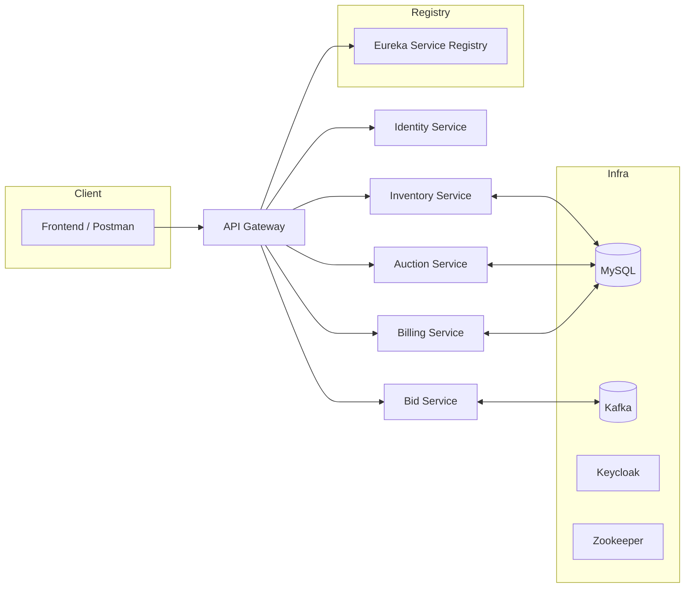

# 🚗 Car Auction Platform (Microservices Architecture)

A **production-style backend system** that demonstrates how to build a scalable, event-driven **car auction platform** using **Spring Boot microservices**.  
This project is designed to showcase **distributed system design, service isolation, API gateway patterns, authentication, and inter-service communication** — making it an excellent portfolio piece for backend engineering.

---

## 📌 Features

- **Service Discovery** with **Eureka** (dynamic service registration & lookup).  
- **API Gateway** with **Spring Cloud Gateway** (routing, filtering, circuit breakers).  
- **Centralized Authentication** with **Keycloak + JWT**.  
- **Vehicle Management** (CRUD for inventory).  
- **Auction Engine** (auction lifecycle & state machine).  
- **Bidding System** with normal & proxy bids via **Kafka**.  
- **Billing Service** for payments & invoices.  
- **Shared DTO Library** for consistent inter-service contracts.  
- **Docker Compose** orchestration with MySQL, Keycloak, Kafka, and Zookeeper.  

---

## 🏗️ Microservices

| Service              | Port  | Description                                                                 |
|----------------------|-------|-----------------------------------------------------------------------------|
| **service-registry** | 8761  | Eureka server for service discovery.                                        |
| **api-gateway**      | 8081  | Entry point to all services (routing, load balancing, filters).             |
| **identity-service** | 8091  | User authentication + JWT validation.                                       |
| **inventory-service**| 8092  | Vehicle CRUD operations.                                                    |
| **auction-service**  | 8093  | Manages auction lifecycle (start, bid, end).                                |
| **bid-service**      | —     | Processes bids, supports proxy bidding, Kafka integration.                  |
| **billing-service**  | —     | Manages payments, invoices, and transactions.                               |
| **common-libs/dto**  | —     | Shared DTOs to enforce consistency across services.                         |

---

## 🧰 Infrastructure Services

| Service   | Port  | Description                                       |
|-----------|-------|---------------------------------------------------|
| **MySQL** | 3307  | Primary relational database (mounted with volume).|
| **Keycloak** | 9000 | Identity & Access Management (admin/admin).      |
| **Zookeeper** | 2181 | Kafka coordination service.                     |
| **Kafka** | 9094  | Event streaming for bidding/notifications.        |

---

## ⚙️ Architecture Overview



---

## 🚀 Getting Started

### Prerequisites
- JDK 21+
- Maven 3.9+
- Docker & Docker Compose

---

### 1️⃣ Run with Docker Compose
```bash
docker-compose up --build
```

This will spin up:
- **MySQL** (port `3307`)
- **Keycloak** (port `9000`)
- **Eureka Registry** (port `8761`)
- **Kafka + Zookeeper**
- All microservices (`api-gateway`, `identity`, `inventory`, `auction`, `bid`, `billing`)

---

### 2️⃣ Access Services

- **Eureka Dashboard** → [http://localhost:8761](http://localhost:8761)  
- **API Gateway** → [http://localhost:8081](http://localhost:8081)  
- **Keycloak Admin Console** → [http://localhost:9000](http://localhost:9000)  
  - Username: `admin`  
  - Password: `admin`  
- **MySQL** → `localhost:3307` (user: `auction`, pass: `auction`, db: `auction`)

---

### 3️⃣ Build & Run Individually
```bash
# From root directory
mvn clean install
cd service-registry && mvn spring-boot:run
cd api-gateway && mvn spring-boot:run
...
```

---


## 📖 Purpose

This project was built as a **portfolio-ready backend showcase**:  
✅ Demonstrates **system design** (scalable, distributed architecture).  
✅ Covers **microservices best practices** (Eureka, Gateway, Keycloak, Kafka).  
✅ Prepares ground for **enterprise extensions** (observability, caching, CI/CD).  

---

## 👤 Author

**Tariq Ghanem**  
Backend Engineer | Passion for Cars & Scalable Systems  
